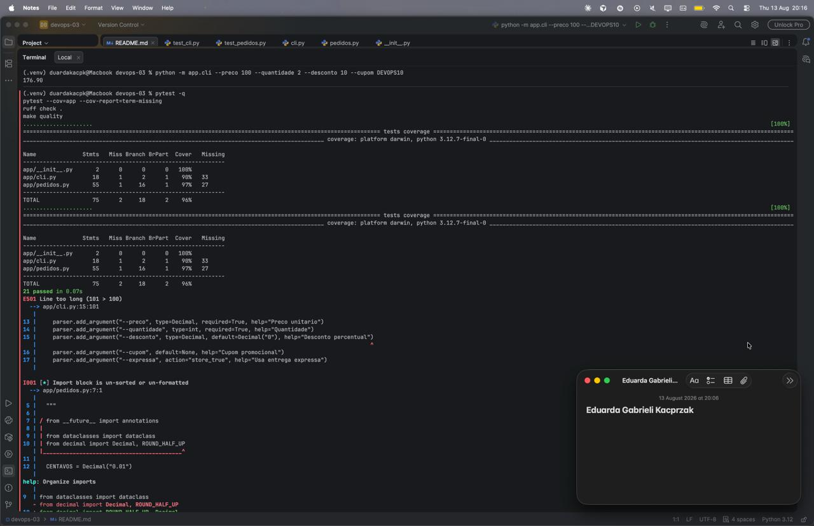

# Relatório — Atividade 03: Testes automatizados e feedback local

**Disciplina:** DevOps
**Atividade:** Aula 03 — Testes automatizados e feedback local

## Objetivo

Evoluir o sistema de pedidos das aulas anteriores criando um ciclo local de feedback
técnico: testes automatizados, cobertura de código, lint e um comando único de
qualidade (`make quality`).

## O que foi implementado

- Regras de negócio em `app/pedidos.py`: cálculo de subtotal, desconto percentual,
  cupom promocional e frete.
- CLI em `app/cli.py` para calcular o total de um pedido pelo terminal.
- Suíte de testes em `tests/` (unitários e de integração da CLI).
- `pyproject.toml` configurando pytest, cobertura por branch e ruff.
- `Makefile` com os atalhos `install`, `test`, `cov`, `lint` e `quality`.

### Nova regra de negócio: cupom `FRETEEXPRESSO`

Cupom que não concede desconto percentual, mas zera o valor do frete expresso quando
o total do pedido (já com desconto) excede R$ 50,00. O campo `cupom` continua único
(`str | None`), então o sistema segue aceitando somente um cupom por pedido.

Implementado em `app/pedidos.py` (`cupom_libera_frete_expresso` e um parâmetro novo
em `calcular_frete`) e coberto por testes novos em `tests/test_pedidos.py`, sem
alterar o comportamento dos testes já existentes.

## Resultado das verificações

```text
ruff check .          -> All checks passed!
pytest --cov=app      -> 33 passed, 96% cobertura
make quality          -> lint + testes + cobertura, sem erros
```



## Conclusão

O ciclo de qualidade local (`make quality`) roda sem erros, com toda a suíte de
testes passando e cobertura de 96% sobre `app/`. A nova regra de negócio foi
adicionada sem quebrar nenhum teste existente e sem abrir a possibilidade de
múltiplos cupons por pedido.
